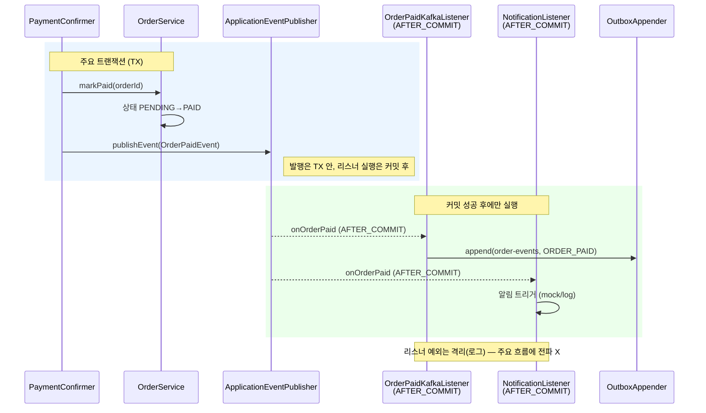
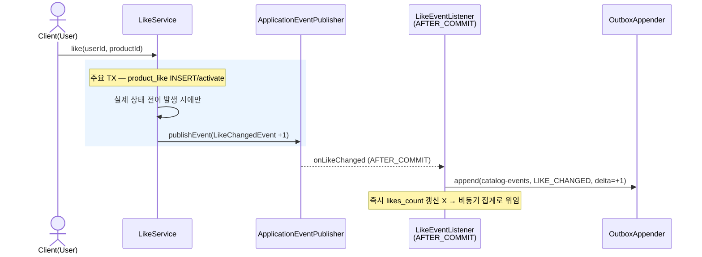
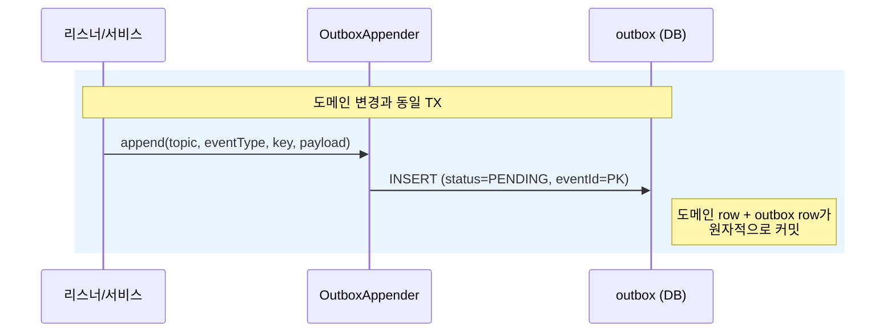
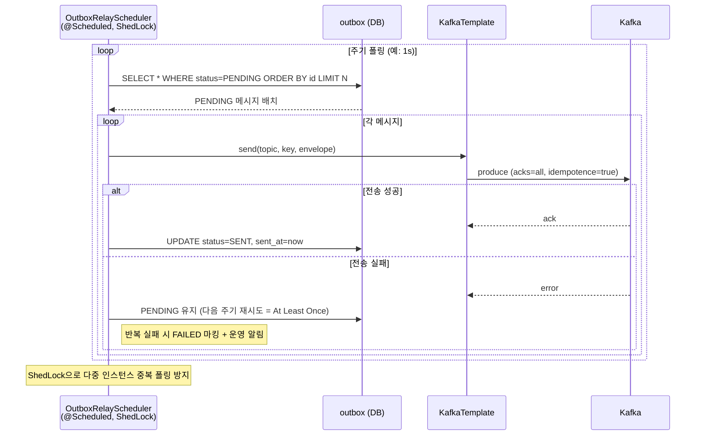
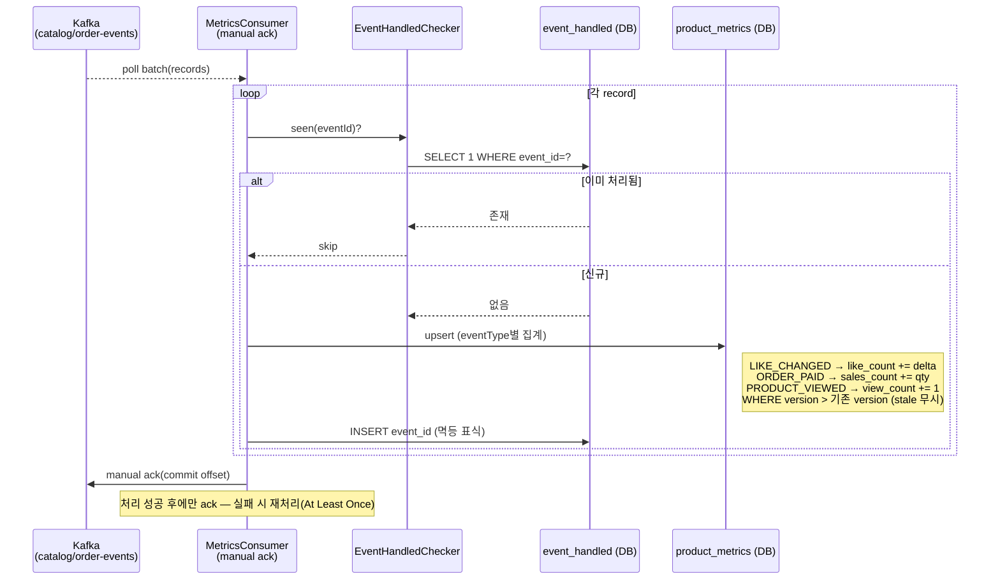
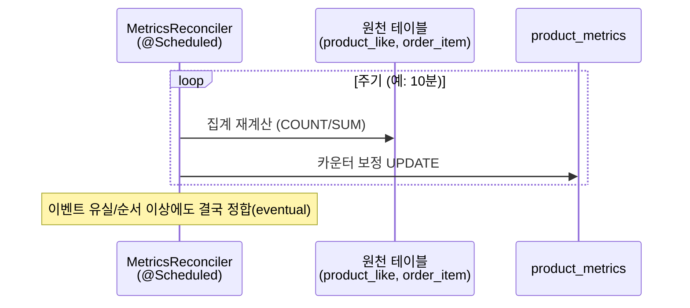
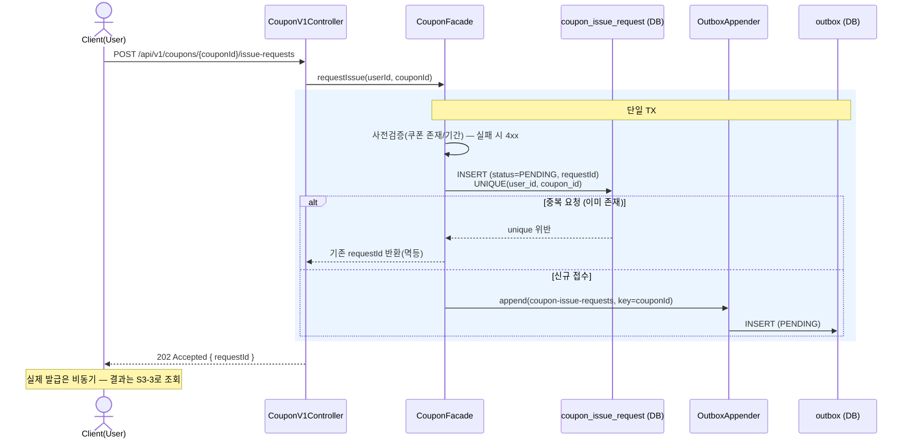
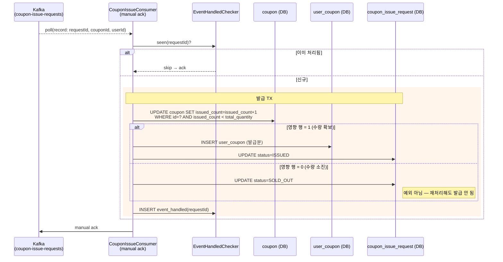
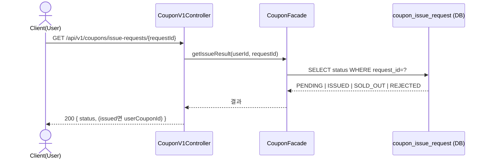
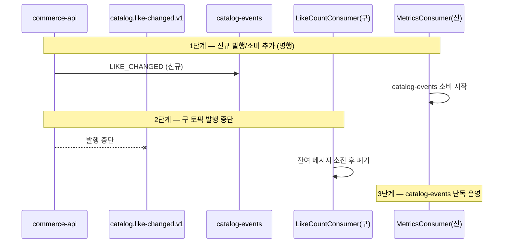

# 02. 시퀀스 다이어그램 — 이벤트 기반 아키텍처 (Event-Driven)

[`01-requirements.md`](./01-requirements.md) §6의 Step1~3 흐름을 레이어별 참여자 기준으로 시각화한다. 표기 규칙은 [`../week2/02-sequence-diagrams.md`](../week2/02-sequence-diagrams.md) §0을 따른다(레이어/화살표/생략/공통 에러). 이 문서의 결정 근거는 [`01-requirements.md`](./01-requirements.md) §9 결정사항 표를 따른다.

## 0. 참여자 (기존 레이어 + week7 신규)

### commerce-api (Producer)

| 약칭 | 클래스/컴포넌트 | 레이어 | 책임 |
| --- | --- | --- | --- |
| `OFac` | `OrderFacade` | Application | 주문 유스케이스 조립 |
| `OSvc` | `OrderService` | Domain Service | 주문 생성·상태 전이 |
| `PFac` | `PaymentFacade` | Application | 결제 시작/콜백/reconcile 조립 |
| `PCfm` | `PaymentConfirmer` | Application | 결제 확정 단위(콜백·reconcile 공유) |
| `LSvc` | `LikeService` | Domain Service | 좋아요 상태 전이 |
| `CFac` | `CouponFacade` | Application | 쿠폰 대고객 유스케이스 |
| `Pub` | `ApplicationEventPublisher` | Spring | 인-프로세스 도메인 이벤트 발행 |
| `Appender` | `OutboxAppender` | Domain/Infra | 도메인 트랜잭션 안에서 `outbox` INSERT |
| `OBox` | `outbox` 테이블 | DB | 발행 대기 메시지(PENDING/SENT/FAILED) |
| `Relay` | `OutboxRelayScheduler` | Infra (@Scheduled+ShedLock) | PENDING 폴링 → Kafka 전송 → SENT 마킹 |
| `KT` | `KafkaTemplate` | Infra | Kafka 발행(acks=all, idempotence=true) |

### Kafka

| 토픽 | 키 | eventType 예 |
| --- | --- | --- |
| `catalog-events` | productId | LIKE_CHANGED, PRODUCT_VIEWED |
| `order-events` | orderId | ORDER_PAID |
| `coupon-issue-requests` | couponId | COUPON_ISSUE_REQUESTED |

### commerce-streamer (Consumer)

| 약칭 | 클래스/컴포넌트 | 책임 |
| --- | --- | --- |
| `MCon` | `MetricsConsumer` (group=metrics-aggregator) | catalog/order 이벤트 소비 → 집계 |
| `CCon` | `CouponIssueConsumer` (group=coupon-issuer) | 발급 요청 소비 → 발급 처리 |
| `Idem` | `EventHandledChecker` | `event_handled(event_id)` 멱등 확인/기록 |
| `EH` | `event_handled` 테이블 | 처리 완료 표식(event_id PK) |
| `PM` | `product_metrics` 테이블 | 좋아요/판매량/조회 수 upsert |
| `CpnW` | `coupon` 테이블 | 원자 UPDATE(issued_count) |
| `UCW` | `user_coupon` 테이블 | 발급분 INSERT |
| `CIR` | `coupon_issue_request` 테이블 | 발급 결과(PENDING/ISSUED/SOLD_OUT/REJECTED) |

> **공통 envelope**: 모든 메시지는 `{ eventId, eventType, aggregateId, occurredAt, version, payload }`를 공유한다. `eventId`는 outbox PK(전역 고유) = 소비자 멱등 키.

---

## Step 1. ApplicationEvent 경계 분리

### S1-1. 결제 확정 시 부가 로직 분리 (AFTER_COMMIT)

주요 로직(결제 확정 → 주문 PAID)과 부가 로직(판매량 전파용 이벤트, 알림)을 분리한다. 부가 리스너 실패가 결제 트랜잭션을 롤백시키지 않는다.

> **판단 기준**: `OrderPaidEvent`는 (a) 결제 확정과 원자적일 필요 없음 + (b) 결과에 영향 없는 후속 + (c) 타 시스템(streamer 판매량 집계)이 필요 → **이벤트 분리 + Kafka 전파(outbox)** 대상. 알림은 (c)가 없으니 ApplicationEvent까지만.

### S1-2. 좋아요 상태 전이 (결과적 일관성, 기존 일반화)

---

## Step 2. Kafka 이벤트 파이프라인

### S2-1. Outbox 발행 (도메인 변경과 단일 트랜잭션)

핵심 불변식: **도메인 변경 INSERT/UPDATE 와 outbox INSERT 는 같은 트랜잭션**. 둘 다 커밋되거나 둘 다 롤백 → 메시지 유실(at-most-once) 제거.

### S2-2. Outbox 릴레이 → Kafka (폴링 스케줄러)

### S2-3. 집계 Consumer — product_metrics upsert (멱등 + 최신성)

> **최신성**: upsert 시 envelope `version`(또는 occurredAt)을 비교해 더 오래된 이벤트가 최신 집계를 덮어쓰지 않게 한다. 좋아요 delta는 교환법칙이 성립하므로 합산은 순서 비의존.

### S2-4. reconcile 안전망 (이벤트 유실 보정)

---

## Step 3. Kafka 기반 선착순 쿠폰 발급

### S3-1. 발급 요청 (API는 발행만, 202 Accepted)

### S3-2. 발급 처리 Consumer (원자 UPDATE + 멱등)

선착순 불변식 `issued_count <= total_quantity`를 어떤 동시성에서도 위반하지 않는다. key=couponId로 같은 쿠폰 요청이 같은 파티션에 직렬화된다.

> **1인 1매**: `coupon_issue_request`의 `UNIQUE(user_id, coupon_id)`(S3-1)가 요청 단계에서, `event_handled(requestId)`가 소비 단계에서 이중 차단. 자격 미달은 `status=REJECTED`로 기록.

### S3-3. 발급 결과 조회

---

## 부록. 좋아요 토픽 마이그레이션 (스키마 통일)

기존 `catalog.like-changed.v1` → `catalog-events`(공통 envelope) 전환. 무중단 이전 절차.

> reconcile(S2-4)이 원천에서 카운트를 재보정하므로, 이전 중 짧은 불일치는 결국 수렴한다.
