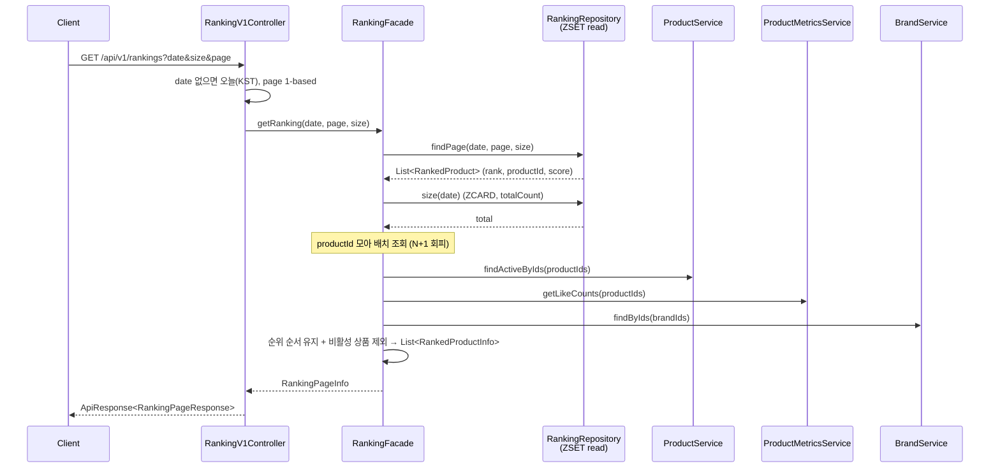
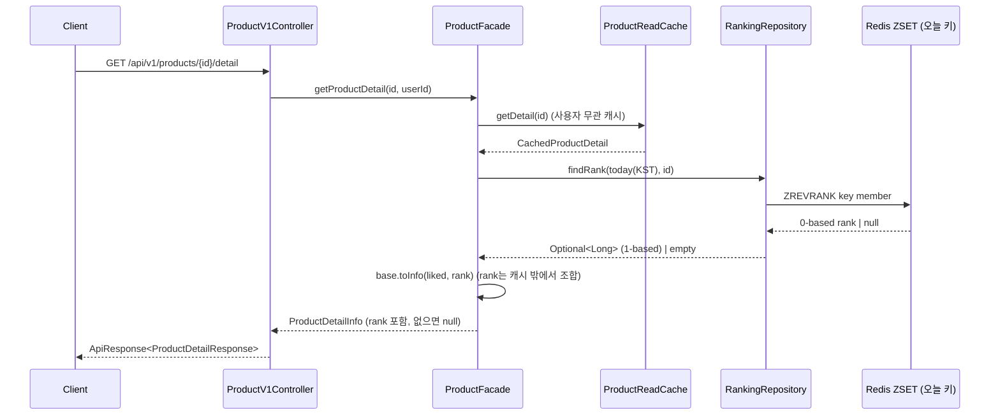

# 02. 시퀀스 다이어그램 — 실시간 랭킹

[`01-requirements.md`](./01-requirements.md)의 흐름을 시스템 간 상호작용으로 확정한다. 크게 두 흐름이다.

1. **적재(Write)** — Kafka Consumer가 이벤트를 배치 소비해 ZSET에 가중 점수를 누적.
2. **조회(Read)** — Ranking API / 상품 상세가 ZSET을 읽어 순위를 노출.

발행측(commerce-api outbox → Kafka)과 `product_metrics` 집계는 [`../week7`](../week7/02-sequence-diagrams.md) 흐름을 재사용하므로 여기선 랭킹 부분만 다룬다.

---

## 1. 적재 — Kafka Consumer → ZSET

`ProductRankingConsumer`(그룹 `ranking-aggregator`)가 `catalog-events` + `order-events`를 **배치**로 받아, `RankingAggregator`가 배치 내 델타를 상품별로 합산한 뒤 `RankingRedisRepository`가 파이프라인 `ZINCRBY`로 반영한다.

```mermaid
sequenceDiagram
    participant K as Kafka<br/>(catalog/order-events)
    participant C as ProductRankingConsumer<br/>(group=ranking-aggregator)
    participant A as RankingAggregator
    participant P as RankingScorePolicy
    participant R as RankingRedisRepository
    participant Z as Redis ZSET<br/>ranking:all:{yyyyMMdd}

    K->>C: poll batch (List<EventEnvelope>)
    C->>A: apply(envelopes)
    loop 각 이벤트
        A->>A: date = RankingKey.dateOf(occurredAt)  (KST)
        A->>A: key  = ranking:all:{yyyyMMdd}
        alt PRODUCT_VIEWED
            A->>P: viewScore()  → +0.1
        else LIKE_CHANGED
            A->>P: likeScore(delta)  → ±0.2
        else ORDER_PAID (items[])
            A->>P: orderScore(unitPrice, qty)  → +0.6·log10(1+매출)
        end
        A->>A: deltas[key][productId] += score  (배치 내 합산)
    end
    A->>R: incrementAll(deltas)
    R->>Z: PIPELINE { ZINCRBY key score member ; EXPIRE key 2d }
    R-->>A: ok
    A-->>C: void
    C->>K: ack (수동 커밋, at-least-once)
```

**핵심 포인트**

- **배치 coalescing**: 같은 `(일간 키, productId)`의 점수를 메모리에서 합산해 상품당 `ZINCRBY` 1회로 줄인다(hot key 완화). 가산은 교환법칙이라 순서 무관.
- **일자 = 이벤트 발생시각(KST)**: 컨슘 지연이 있어도 이벤트가 발생한 날짜 버킷에 반영된다.
- **수동 커밋**: ZSET 반영 후 ack(at-least-once). 재전달 시 소폭 이중 가산은 근사값으로 수용(P-1).

---

## 2. 조회 — Ranking API (오늘의 인기상품)



**핵심 포인트**

- ZSET은 `productId`·`score`·`rank`만 안다. 상품 요약(이름/가격/브랜드/좋아요수)은 Facade가 **배치 조회 3회**로 조립한다(상품·좋아요수·브랜드명).
- `findPage`는 `reverseRangeWithScores(key, (page-1)*size, …)`로 내림차순 상위를 가져오고, rank는 `offset + index + 1`(1-based).
- ZSET엔 있으나 삭제/비활성된 상품은 `findActiveByIds` 결과에서 빠져 랭킹에서 제외된다(P-2).

---

## 3. 조회 — 상품 상세의 실시간 순위



**핵심 포인트**

- `rank`는 실시간 값이라 **캐시에 담지 않는다**. 사용자 무관 상세는 캐시에서, `liked`와 `rank`만 캐시 밖에서 실시간 조합한다.
- 오늘 랭킹에 없는 상품은 `rank = null`.
